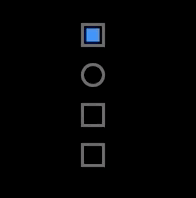

# Checkbox

Extremely simple checkbox control for iOS using CoreAnimation layers.

Included is a playground for playing with a collection of checkboxen.

## Configuration

* `isChecked` -- the current value of the control.
* `borderLineWidth` -- the line width of the border that is drawn around the view's frame
* `borderShape` -- the border to render. Currently supports two shapes: square and circle
* `uncheckedBorderColor` -- the color of the border when the control is unchecked
* `checkedBorderColor` -- the color of the border when the control is checked
* `checkShape` -- the checked indicator to render. Support 4 shapes: square, circle, check, and cross
* `checkLineWidth` -- the line width of the check and cross shapes
* `checkInserts` -- the amount to reduce the border frame before being used for the checked shape frame

NOTE: the color of the checked shape comes from the UIView `tintColor` value.
